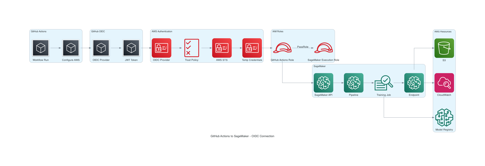

# GitHub Actions to SageMaker Connection - Quick Summary

## How It Works (Simple Explanation)

GitHub Actions connects to AWS SageMaker using **OIDC (OpenID Connect)** - a secure way to authenticate **without storing AWS credentials** in GitHub.

## The 3-Step Process

### 1️⃣ GitHub Actions Requests Access

```yaml
# In your workflow file
permissions:
  id-token: write  # ← Allows requesting OIDC token

- name: Configure AWS credentials
  uses: aws-actions/configure-aws-credentials@v4
  with:
    role-to-assume: ${{ secrets.AWS_ROLE_ARN }}
    aws-region: us-east-1
```

**What happens:**
- GitHub Actions requests a JWT token from GitHub's OIDC provider
- Token contains: repository name, workflow name, branch, who triggered it

### 2️⃣ AWS Validates and Issues Credentials

```
GitHub Token → AWS OIDC Provider → Trust Policy Check → AWS STS
                                                           ↓
                                                  Temporary Credentials
                                                  (expires in 1 hour)
```

**AWS checks:**
- ✅ Is the token signed by GitHub?
- ✅ Is it from the correct repository?
- ✅ Is the audience correct (`sts.amazonaws.com`)?
- ✅ Has it expired?

**If all checks pass:**
- AWS STS issues temporary credentials (AccessKey, SecretKey, SessionToken)
- Credentials are valid for 1 hour (configurable)

### 3️⃣ Use Credentials to Call SageMaker

```yaml
- name: Create SageMaker Pipeline
  run: |
    python pipelines/create_pipeline.py
```

**Behind the scenes:**
```python
import boto3

# AWS SDK automatically uses the temporary credentials
# from environment variables set by the configure-aws-credentials action
sm_client = boto3.client('sagemaker')
sm_client.create_pipeline(...)  # ← This works!
```

## Visual Flow



## Key Components

### In AWS (Created by Terraform)

1. **OIDC Provider**
   - URL: `https://token.actions.githubusercontent.com`
   - Trusts GitHub to issue tokens

2. **GitHub Actions IAM Role**
   - Trust policy: Only accepts tokens from your repository
   - Permissions: Can call SageMaker APIs

3. **SageMaker Execution IAM Role**
   - Used BY SageMaker (not by GitHub Actions)
   - Permissions: Access S3, CloudWatch, etc.

### In GitHub

1. **Repository Secrets**
   - `AWS_ROLE_ARN`: ARN of GitHub Actions role
   - `SAGEMAKER_EXECUTION_ROLE_ARN`: ARN of SageMaker role

2. **Workflow Permissions**
   - `id-token: write` - Required to request OIDC tokens

## Why This Is Secure

### ❌ Old Way (Insecure)
```yaml
# DON'T DO THIS!
env:
  AWS_ACCESS_KEY_ID: AKIA...
  AWS_SECRET_ACCESS_KEY: ...
```

**Problems:**
- Keys stored in GitHub (can be leaked)
- Keys never expire
- If compromised, attacker has permanent access
- Manual rotation required

### ✅ New Way (Secure - OIDC)
```yaml
# DO THIS!
permissions:
  id-token: write

- uses: aws-actions/configure-aws-credentials@v4
  with:
    role-to-assume: ${{ secrets.AWS_ROLE_ARN }}
```

**Benefits:**
- ✅ No credentials stored in GitHub
- ✅ Credentials expire after 1 hour
- ✅ Automatic rotation on each run
- ✅ Scoped to specific repository
- ✅ Complete audit trail

## Setup Checklist

- [ ] Create OIDC provider in AWS
- [ ] Create GitHub Actions IAM role with trust policy
- [ ] Create SageMaker execution IAM role
- [ ] Add role ARNs to GitHub secrets
- [ ] Add `id-token: write` permission to workflow
- [ ] Use `configure-aws-credentials` action
- [ ] Test connection

## Common Issues

### "Not authorized to perform sts:AssumeRoleWithWebIdentity"

**Cause:** Trust policy doesn't match your repository

**Fix:** Check trust policy condition:
```json
"Condition": {
  "StringLike": {
    "token.actions.githubusercontent.com:sub": "repo:YOUR-ORG/YOUR-REPO:*"
  }
}
```

### "OIDC provider not found"

**Cause:** OIDC provider not created in AWS

**Fix:** Run `terraform apply` to create it

### "Access denied" when calling SageMaker

**Cause:** GitHub Actions role lacks permissions

**Fix:** Add SageMaker permissions to role policy

## Example: Complete Workflow

```yaml
name: Train Model

on:
  push:
    branches: [main]

jobs:
  train:
    runs-on: ubuntu-latest
    
    # STEP 1: Grant OIDC permission
    permissions:
      id-token: write
      contents: read
    
    steps:
      - uses: actions/checkout@v4
      
      # STEP 2: Get AWS credentials via OIDC
      - name: Configure AWS credentials
        uses: aws-actions/configure-aws-credentials@v4
        with:
          role-to-assume: ${{ secrets.AWS_ROLE_ARN }}
          aws-region: us-east-1
      
      # STEP 3: Use SageMaker (credentials are automatic!)
      - name: Create Pipeline
        run: |
          aws sagemaker create-pipeline \
            --pipeline-name my-pipeline \
            --role-arn ${{ secrets.SAGEMAKER_EXECUTION_ROLE_ARN }}
      
      - name: Start Training
        run: |
          aws sagemaker start-pipeline-execution \
            --pipeline-name my-pipeline
```

## Terraform Setup

```hcl
# 1. OIDC Provider
resource "aws_iam_openid_connect_provider" "github" {
  url            = "https://token.actions.githubusercontent.com"
  client_id_list = ["sts.amazonaws.com"]
  thumbprint_list = ["6938fd4d98bab03faadb97b34396831e3780aea1"]
}

# 2. GitHub Actions Role
resource "aws_iam_role" "github_actions" {
  name = "GitHubActionsRole"
  
  assume_role_policy = jsonencode({
    Version = "2012-10-17"
    Statement = [{
      Effect = "Allow"
      Principal = {
        Federated = aws_iam_openid_connect_provider.github.arn
      }
      Action = "sts:AssumeRoleWithWebIdentity"
      Condition = {
        StringEquals = {
          "token.actions.githubusercontent.com:aud" = "sts.amazonaws.com"
        }
        StringLike = {
          "token.actions.githubusercontent.com:sub" = "repo:YOUR-ORG/YOUR-REPO:*"
        }
      }
    }]
  })
}

# 3. Permissions
resource "aws_iam_role_policy" "github_actions" {
  role = aws_iam_role.github_actions.id
  
  policy = jsonencode({
    Version = "2012-10-17"
    Statement = [{
      Effect = "Allow"
      Action = [
        "sagemaker:CreatePipeline",
        "sagemaker:StartPipelineExecution",
        "sagemaker:CreateEndpoint",
        "iam:PassRole"
      ]
      Resource = "*"
    }]
  })
}
```

## Resources

- **Detailed Guide:** [GITHUB_TO_SAGEMAKER_CONNECTION.md](GITHUB_TO_SAGEMAKER_CONNECTION.md)
- **Setup Guide:** [SETUP_GUIDE.md](SETUP_GUIDE.md)
- **Architecture Diagrams:** [ARCHITECTURE_DIAGRAMS.md](ARCHITECTURE_DIAGRAMS.md)

## Summary

**GitHub Actions connects to SageMaker using:**
1. OIDC tokens (no stored credentials)
2. Temporary AWS credentials (1 hour expiry)
3. IAM roles with trust policies

**This is the modern, secure way to connect CI/CD to AWS!** 🔒
