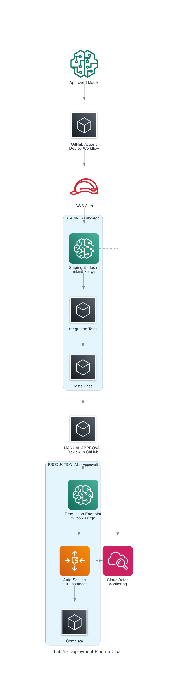

# Diagram Selection Guide

Quick guide to help you choose the right diagram for your needs.

---

## Lab 5 Deployment Pipeline Diagrams

We have **4 versions** of the Lab 5 deployment diagram, each optimized for different use cases:

### 1. lab5-final.png ⭐ RECOMMENDED

**Best for:** Presentations, quick understanding, executive summaries

**Style:** Simple vertical flow, minimal clutter

**Shows:**
- Clear progression from approved model to production
- Staging and production environments clearly separated
- Manual approval gate highlighted
- Monitoring shown as side connection

**Use when:**
- Presenting to stakeholders
- Quick overview needed
- Teaching the basic flow
- Creating slides

**Flow:**
```
Approved Model
    ↓
GitHub Actions
    ↓
Staging (Automatic)
    ↓
Manual Approval
    ↓
Production (After Approval)
    ↓
Monitoring
```

---

### 2. lab5-stepbystep.png

**Best for:** Training, step-by-step walkthroughs, tutorials

**Style:** Horizontal flow with numbered steps

**Shows:**
- 6 clear steps from left to right
- Each step in its own box
- Linear progression
- Easy to follow sequence

**Use when:**
- Training new team members
- Creating tutorials
- Step-by-step documentation
- Workshop materials

**Flow:**
```
1. Trigger → 2. GitHub Actions → 3. Staging → 4. Approval → 5. Production → 6. Monitor
```

---

### 3. lab5-deployment-clear.png

**Best for:** Technical documentation, detailed understanding

**Style:** Vertical flow with more details

**Shows:**
- Staging and production as distinct stages
- Test execution details
- Configuration steps
- User interactions

**Use when:**
- Writing technical documentation
- Explaining to developers
- Showing more context
- Architecture reviews

**Flow:**
```
Model Approved
    ↓
GitHub Actions (Auth)
    ↓
STAGE 1: Staging
  - Deploy
  - Test
  - Pass
    ↓
Manual Approval
    ↓
STAGE 2: Production
  - Deploy
  - Auto Scale
  - Complete
    ↓
Monitoring + Users
```

---

### 4. lab5-deployment-pipeline.png (Original)

**Best for:** Complete technical reference, comprehensive view

**Style:** Detailed with all components

**Shows:**
- All GitHub components (repo, workflows, environments)
- All AWS components (IAM, Model Registry, endpoints)
- All connections and relationships
- Testing and monitoring details

**Use when:**
- Need complete picture
- Technical deep dive
- Architecture documentation
- Reference material

**Flow:**
```
Developer → GitHub (Repo, Workflows, Environments)
    ↓
AWS (IAM, Model Registry)
    ↓
Staging Environment (Endpoint, Tests)
    ↓
Manual Approval
    ↓
Production Environment (Endpoint, Auto Scaling)
    ↓
Monitoring (CloudWatch, Logs, Alarms)
    ↓
API Users
```

---

## Quick Selection Matrix

| Use Case | Recommended Diagram | Why |
|----------|-------------------|-----|
| Executive presentation | lab5-final.png | Simple, clear, professional |
| Team training | lab5-stepbystep.png | Easy to follow, numbered steps |
| Developer onboarding | lab5-deployment-clear.png | Good detail level |
| Technical documentation | lab5-deployment-pipeline.png | Complete information |
| Quick reference | lab5-final.png | Fast to understand |
| Workshop/tutorial | lab5-stepbystep.png | Step-by-step learning |
| Architecture review | lab5-deployment-pipeline.png | All components visible |
| Slide deck | lab5-final.png | Clean, minimal |

---

## Lab 4 Model Build Pipeline

**File:** `lab4-model-build-pipeline.png`

**Best for:** Understanding the training pipeline

**Shows:**
- GitHub Actions triggering SageMaker Pipeline
- Pipeline steps (Preprocess, Train, Evaluate, Register)
- Data flow through S3
- Model Registry integration
- CloudWatch monitoring

**Use when:**
- Explaining the training process
- Showing ML pipeline architecture
- Documenting data flow
- Training data scientists

---

## Complete Architecture

**File:** `complete-mlops-architecture-github.png`

**Best for:** End-to-end system understanding

**Shows:**
- Complete flow from code to production
- Both build and deploy pipelines
- All AWS services
- Data storage and flow
- Monitoring and inference

**Use when:**
- System overview needed
- Explaining to new team members
- Architecture documentation
- Stakeholder presentations

---

## Tips for Using Diagrams

### In Documentation
```markdown
# Deployment Process

Our deployment follows a two-stage process:



For detailed steps, see the [complete guide](DEPLOYMENT_GUIDE.md).
```

### In Presentations
- Use `lab5-final.png` for slides (clean, simple)
- Add annotations if needed
- Keep one diagram per slide
- Explain the flow verbally

### In Training Materials
- Start with `lab5-stepbystep.png` (easy to follow)
- Progress to `lab5-deployment-clear.png` (more detail)
- End with `lab5-deployment-pipeline.png` (complete picture)

### In Technical Docs
- Use `lab5-deployment-pipeline.png` (comprehensive)
- Reference specific components
- Link to related documentation

---

## Diagram Comparison

### Complexity Level
```
Simple                                                    Complex
  |                    |                    |                |
lab5-final    lab5-stepbystep    lab5-deployment-clear    lab5-deployment-pipeline
```

### Detail Level
```
Overview                                                  Detailed
  |                    |                    |                |
lab5-final    lab5-stepbystep    lab5-deployment-clear    lab5-deployment-pipeline
```

### Best Audience
- **lab5-final.png:** Everyone (executives, managers, developers)
- **lab5-stepbystep.png:** Learners (new team members, students)
- **lab5-deployment-clear.png:** Developers (engineers, architects)
- **lab5-deployment-pipeline.png:** Technical experts (senior engineers, architects)

---

## Common Questions

### Q: Which diagram should I use in my README?
**A:** Use `lab5-final.png` - it's clear and simple for first-time readers.

### Q: Which diagram for a technical deep dive?
**A:** Use `lab5-deployment-pipeline.png` - shows all components and connections.

### Q: Which diagram for training new developers?
**A:** Start with `lab5-stepbystep.png`, then progress to others.

### Q: Which diagram for a 5-minute presentation?
**A:** Use `lab5-final.png` - quick to explain, easy to understand.

### Q: Can I use multiple diagrams?
**A:** Yes! Use different diagrams for different sections:
- Overview: `lab5-final.png`
- Detailed steps: `lab5-stepbystep.png`
- Technical reference: `lab5-deployment-pipeline.png`

---

## Summary

**For most use cases, start with `lab5-final.png`** - it's the clearest and easiest to understand.

If you need more detail, progress through:
1. `lab5-final.png` - Basic understanding
2. `lab5-stepbystep.png` - Step-by-step flow
3. `lab5-deployment-clear.png` - More context
4. `lab5-deployment-pipeline.png` - Complete picture

Choose based on your audience and purpose, not just personal preference.

---

## Related Documentation

- [LAB_DIAGRAMS.md](LAB_DIAGRAMS.md) - Detailed explanation of all diagrams
- [ARCHITECTURE_DIAGRAMS.md](ARCHITECTURE_DIAGRAMS.md) - Other architecture diagrams
- [DEPLOYMENT_STEPS.md](DEPLOYMENT_STEPS.md) - Step-by-step deployment guide
- [IMPLEMENTATION_COMPARISON.md](IMPLEMENTATION_COMPARISON.md) - Comparison with AWS Workshop
