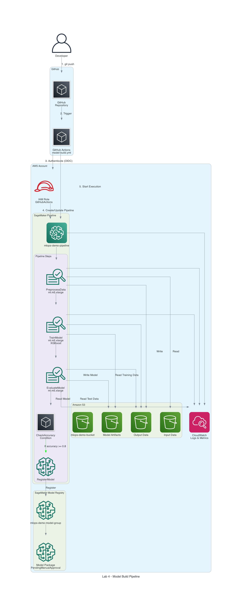
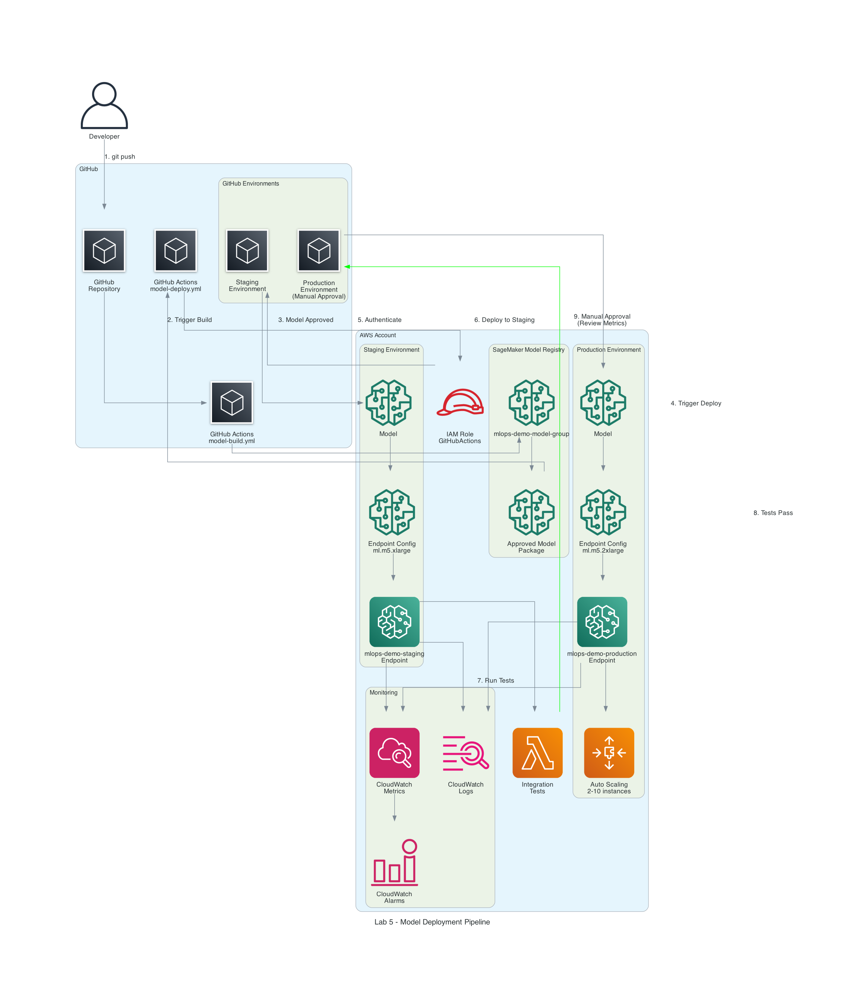

# Lab Architecture Diagrams - GitHub Actions Implementation

Visual representations of the MLOps implementation matching AWS Workshop Labs 4 & 5 structure, but using GitHub Actions instead of AWS CodePipeline.

---

## 📊 Available Diagrams

All diagrams are located in the `generated-diagrams/` folder.

---

## 1. Lab 4 - Model Build Pipeline

**File:** `lab4-model-build-pipeline.png`

**Description:** Complete model training pipeline showing the GitHub Actions workflow that replaces AWS CodePipeline from the original Lab 4.

### Architecture Components:

#### GitHub Layer
- **Developer:** Pushes code to trigger the pipeline
- **GitHub Repository:** Version-controlled codebase
- **GitHub Actions (model-build.yml):** CI/CD workflow that orchestrates the training

#### AWS Layer
- **IAM Role:** GitHub Actions authenticates via OIDC (no long-lived credentials)
- **Amazon S3:** 
  - Input data storage
  - Processed data (train/validation/test splits)
  - Model artifacts (model.tar.gz)
- **SageMaker Pipeline (mlops-demo-pipeline):**
  - **PreprocessData:** Splits data into train/val/test sets (ml.m5.xlarge)
  - **TrainModel:** Trains XGBoost model (ml.m5.xlarge)
  - **EvaluateModel:** Calculates metrics on test data (ml.m5.xlarge)
  - **CheckAccuracy:** Conditional step (registers if accuracy >= 0.8)
  - **RegisterModel:** Registers model to Model Registry
- **Model Registry (mlops-demo-model-group):** Stores versioned models with "PendingManualApproval" status
- **CloudWatch:** Logs and metrics for all pipeline steps

### Workflow:
1. Developer pushes code to GitHub
2. GitHub Actions workflow triggers automatically
3. Workflow authenticates to AWS using OIDC
4. Workflow creates/updates SageMaker Pipeline
5. Workflow starts pipeline execution
6. Pipeline runs preprocessing → training → evaluation
7. If accuracy >= 0.8, model is registered to Model Registry
8. CloudWatch captures all logs and metrics

### Key Difference from AWS Workshop:
- **Original Lab 4:** Uses AWS CodePipeline + CodeBuild
- **Our Implementation:** Uses GitHub Actions (simpler, no additional AWS services needed)

---

## 2. Lab 5 - Model Deployment Pipeline

**Files:** 
- `lab5-final.png` - **RECOMMENDED** - Clearest vertical flow
- `lab5-deployment-clear.png` - Alternative clear version
- `lab5-stepbystep.png` - Horizontal step-by-step view
- `lab5-deployment-pipeline.png` - Original detailed version

**Description:** Complete deployment pipeline showing staging and production deployment with GitHub Environments replacing AWS deployment mechanisms from Lab 5.

### Recommended Diagram: lab5-final.png

This is the clearest version showing the deployment flow in a simple top-to-bottom sequence.

### Architecture Components:

#### GitHub Layer
- **Developer:** Triggers deployment process
- **GitHub Repository:** Source of deployment code
- **GitHub Actions Workflows:**
  - **model-build.yml:** Completes training and model approval
  - **model-deploy.yml:** Handles deployment to staging and production
- **GitHub Environments:**
  - **Staging Environment:** Automatic deployment, no approval needed
  - **Production Environment:** Requires manual approval before deployment

#### AWS Layer
- **IAM Role:** Secure authentication for deployment actions
- **Model Registry:**
  - Model Package Group (mlops-demo-model-group)
  - Approved Model Package (ready for deployment)

- **Staging Environment:**
  - Endpoint: mlops-demo-staging
  - Instance: ml.m5.xlarge (1 instance)
  - Purpose: Automated testing and validation

- **Production Environment:**
  - Endpoint: mlops-demo-production
  - Instance: ml.m5.2xlarge (2-10 instances)
  - Auto Scaling: Scales between 2-10 instances based on load
  - Purpose: Serve production traffic

- **Testing:** Integration tests run automatically on staging
- **Monitoring:**
  - CloudWatch Metrics (invocations, latency, errors)
  - CloudWatch Logs (endpoint logs)
  - CloudWatch Alarms (alert on issues)

### Simplified Workflow (lab5-final.png):

**Step-by-Step Flow:**

1. **Approved Model** → Model is approved in Model Registry
2. **GitHub Actions** → Deployment workflow triggers automatically
3. **AWS Auth** → Authenticate via OIDC (no credentials stored)
4. **STAGING (Automatic):**
   - Deploy to staging endpoint (ml.m5.xlarge, 1 instance)
   - Run integration tests automatically
   - Validate all tests pass
5. **MANUAL APPROVAL:**
   - Review test results in GitHub UI
   - Approve to proceed to production
6. **PRODUCTION (After Approval):**
   - Deploy to production endpoint (ml.m5.2xlarge)
   - Configure auto scaling (2-10 instances)
   - Complete deployment
7. **Monitoring:**
   - CloudWatch monitors both staging and production
   - Logs, metrics, and alarms track performance

### Detailed Workflow (Original):
1. Developer pushes code to GitHub
2. Build workflow completes and model is approved
3. Approved model triggers deployment workflow
4. Workflow authenticates to AWS
5. **Staging Deployment:**
   - Deploy model to staging endpoint
   - Run integration tests automatically
   - Validate endpoint health
6. **Manual Approval Gate:**
   - Review test results and metrics
   - Approve deployment in GitHub UI
7. **Production Deployment:**
   - Deploy model to production endpoint
   - Enable auto scaling (2-10 instances)
   - Configure CloudWatch monitoring
8. Monitoring captures all metrics and logs

### Key Difference from AWS Workshop:
- **Original Lab 5:** Uses AWS CodePipeline with manual approval in AWS Console
- **Our Implementation:** Uses GitHub Environments with approval in GitHub UI (unified experience)

---

## Visual Guide: Which Diagram to Use?

### For Quick Understanding
**Use:** `lab5-final.png`
- Simple vertical flow
- Easy to follow
- Best for presentations

### For Step-by-Step Learning
**Use:** `lab5-stepbystep.png`
- Horizontal flow with numbered steps
- Clear progression
- Best for training

### For Detailed Analysis
**Use:** `lab5-deployment-pipeline.png`
- Shows all components
- Detailed connections
- Best for technical documentation

---

## 3. Complete MLOps Architecture

**File:** `complete-mlops-architecture-github.png`

**Description:** End-to-end MLOps architecture showing the complete flow from code commit to production deployment.

### Architecture Components:

#### Developer Workflow
- Data Scientists/ML Engineers push code to GitHub
- GitHub repository stores all code and configuration

#### CI/CD Layer (GitHub Actions)
- **model-build.yml:** Orchestrates training pipeline
- **model-deploy.yml:** Orchestrates deployment pipeline
- **GitHub Environments:** Staging and Production with approval gates

#### AWS Authentication
- **OIDC Provider:** Secure, temporary credentials (no access keys)
- **IAM Role:** Least privilege permissions for GitHub Actions

#### Data Storage (Amazon S3)
- **Input Data:** Raw CSV files
- **Processed Data:** Train/validation/test splits
- **Model Artifacts:** Trained models (model.tar.gz)

#### ML Pipeline (SageMaker)
- **Pipeline:** mlops-demo-pipeline
- **Preprocess Step:** Data splitting (ml.m5.xlarge)
- **Train Step:** XGBoost training (ml.m5.xlarge)
- **Evaluate Step:** Model evaluation (ml.m5.xlarge)
- **Register Step:** Conditional registration (if accuracy >= 0.8)

#### Model Registry
- **Model Package Group:** mlops-demo-model-group
- Stores all model versions with metadata

#### Deployment Environments
- **Staging:**
  - Endpoint: mlops-demo-staging
  - Instance: ml.m5.xlarge (1 instance)
  - Automatic deployment after build
  
- **Production:**
  - Endpoint: mlops-demo-production
  - Instance: ml.m5.2xlarge (2-10 instances)
  - Auto Scaling enabled
  - Manual approval required

#### Monitoring
- **CloudWatch:** Centralized monitoring for all components
- Tracks pipeline execution, endpoint metrics, and system health

#### End Users
- API users make predictions via staging or production endpoints

### Complete Flow:
1. **Build Phase:**
   - Developer pushes code → GitHub Actions triggers
   - Authenticate via OIDC → Create/execute SageMaker Pipeline
   - Pipeline processes data → trains model → evaluates
   - If accuracy >= 0.8 → register to Model Registry

2. **Deploy Phase:**
   - Approved model triggers deployment workflow
   - Deploy to staging → run automated tests
   - Manual approval → deploy to production
   - Enable auto scaling and monitoring

3. **Inference Phase:**
   - API users send requests to endpoints
   - Endpoints return predictions
   - CloudWatch monitors performance

---

## Comparison with AWS Workshop

### Original AWS Workshop (Labs 4 & 5)

**Lab 4 Architecture:**
```
Developer → SageMaker Studio Notebook
         → Manually create pipeline
         → Manually execute pipeline
         → Manually register model
```

**Lab 5 Architecture:**
```
Developer → AWS CodePipeline
         → AWS CodeBuild
         → CloudFormation
         → SageMaker Endpoints
         → Manual approval in AWS Console
```

### Our GitHub Actions Implementation

**Lab 4 Equivalent:**
```
Developer → GitHub Repository
         → GitHub Actions (model-build.yml)
         → SageMaker Pipeline (automated)
         → Model Registry (automated)
```

**Lab 5 Equivalent:**
```
Developer → GitHub Repository
         → GitHub Actions (model-deploy.yml)
         → GitHub Environments (staging/production)
         → SageMaker Endpoints (automated)
         → Manual approval in GitHub UI
```

---

## Key Improvements Over AWS Workshop

### 1. Simplified Architecture
- **Before:** 5 AWS services (CodeCommit, CodePipeline, CodeBuild, CloudFormation, SageMaker)
- **After:** 2 services (GitHub Actions, SageMaker)

### 2. Cost Reduction
- **Before:** ~$50-100/month for CodePipeline + CodeBuild
- **After:** $0/month (GitHub Actions free tier)

### 3. Unified Experience
- **Before:** Multiple AWS consoles (CodePipeline, SageMaker Studio, CloudFormation)
- **After:** Single GitHub UI for everything

### 4. Better Version Control
- **Before:** Notebooks in SageMaker Studio (limited Git integration)
- **After:** Everything in Git with full history

### 5. Easier Collaboration
- **Before:** Share AWS accounts, complex IAM setup
- **After:** Standard Git workflows (pull requests, code reviews)

### 6. Security
- **Before:** Long-lived AWS access keys
- **After:** OIDC with temporary credentials (no keys stored)

---

## How to Use These Diagrams

### In Documentation
Reference diagrams in your documentation:
```markdown



```

### In Presentations
Use these diagrams to:
- Explain the implementation to stakeholders
- Compare with AWS Workshop approach
- Show the simplified architecture
- Demonstrate cost savings

### In Training
Use these diagrams for:
- Onboarding new team members
- Teaching MLOps concepts
- Explaining CI/CD workflows
- Showing deployment strategies

---

## Diagram Legend

### Icons Used

**Users:**
- 👤 User - Developer, Data Scientist, ML Engineer, API User

**GitHub:**
- 📦 General - Repository, Workflows, Steps, Environments

**AWS Services:**
- 🔐 IAM - IAM Roles, OIDC Provider
- 🤖 Sagemaker - SageMaker Pipeline, Endpoints
- 📊 SagemakerTrainingJob - Processing, Training, Evaluation steps
- 📦 SagemakerModel - Model Registry, Model Packages, Endpoint Configs
- 💾 S3 - Storage buckets for data and models
- 📈 AutoScaling - Auto Scaling Groups
- 📊 Cloudwatch - Monitoring service
- 📝 CloudwatchLogs - Log streams
- 🔔 CloudwatchAlarm - Alarms and alerts
- ⚡ Lambda - Integration test functions

**Connections:**
- → Solid arrow - Data/control flow
- ⇢ Labeled arrow - Specific action with description
- Green arrow - Success path
- Dashed arrow - Monitoring/logging

---

## Technical Details

### Lab 4 Pipeline Steps

1. **PreprocessData**
   - Instance: ml.m5.xlarge
   - Input: Raw CSV from S3
   - Output: Train/validation/test splits to S3
   - Duration: ~5 minutes

2. **TrainModel**
   - Instance: ml.m5.xlarge
   - Algorithm: XGBoost 1.5-1
   - Input: Training data from S3
   - Output: Model artifacts to S3
   - Duration: ~10 minutes

3. **EvaluateModel**
   - Instance: ml.m5.xlarge
   - Input: Model + test data from S3
   - Output: Metrics (accuracy, precision, recall, F1, AUC)
   - Duration: ~3 minutes

4. **CheckAccuracy**
   - Condition: accuracy >= 0.8
   - If true: Proceed to RegisterModel
   - If false: Skip registration

5. **RegisterModel**
   - Registers model to Model Registry
   - Status: PendingManualApproval
   - Metadata: Git commit, training date, metrics

### Lab 5 Deployment Configuration

**Staging Environment:**
- Endpoint Name: mlops-demo-staging
- Instance Type: ml.m5.xlarge
- Instance Count: 1 (fixed)
- Deployment: Automatic after build
- Testing: Automated integration tests
- Purpose: Validation before production

**Production Environment:**
- Endpoint Name: mlops-demo-production
- Instance Type: ml.m5.2xlarge
- Instance Count: 2-10 (auto scaling)
- Deployment: Manual approval required
- Monitoring: Full CloudWatch monitoring
- Purpose: Serve production traffic

**Auto Scaling Configuration:**
- Min Instances: 2
- Max Instances: 10
- Target Metric: SageMakerVariantInvocationsPerInstance
- Target Value: 70 invocations per instance
- Scale-out Cooldown: 300 seconds
- Scale-in Cooldown: 300 seconds

---

## Regenerating Diagrams

If you need to update these diagrams:

1. **Install dependencies:**
   ```bash
   pip install diagrams
   ```

2. **Modify the diagram code** (see generation scripts)

3. **Regenerate:**
   ```bash
   python generate_lab_diagrams.py
   ```

4. **Commit changes:**
   ```bash
   git add generated-diagrams/
   git commit -m "Update lab architecture diagrams"
   git push
   ```

---

## Related Documentation

- [IMPLEMENTATION_COMPARISON.md](IMPLEMENTATION_COMPARISON.md) - Detailed comparison with AWS Workshop
- [ARCHITECTURE_DIAGRAMS.md](ARCHITECTURE_DIAGRAMS.md) - Other architecture diagrams
- [SETUP_GUIDE.md](SETUP_GUIDE.md) - Setup instructions
- [DEPLOYMENT_STEPS.md](DEPLOYMENT_STEPS.md) - Deployment procedures
- [BEST_PRACTICES.md](BEST_PRACTICES.md) - MLOps best practices

---

## Quick Reference

| Diagram | AWS Workshop Lab | Purpose | Audience |
|---------|-----------------|---------|----------|
| Lab 4 - Model Build | Lab 4 | Training pipeline | Data Scientists, ML Engineers |
| Lab 5 - Deployment | Lab 5 | Deployment pipeline | DevOps, MLOps Engineers |
| Complete Architecture | Labs 4 & 5 | End-to-end flow | All stakeholders |

---

## Summary

These diagrams show how we've implemented the AWS Workshop Labs 4 & 5 using GitHub Actions instead of AWS CodePipeline:

✅ **Same functionality** - All features from the workshop
✅ **Simpler architecture** - Fewer AWS services needed
✅ **Lower cost** - $0/month vs $50-100/month
✅ **Better UX** - Single GitHub UI instead of multiple AWS consoles
✅ **More secure** - OIDC instead of long-lived credentials
✅ **Easier collaboration** - Standard Git workflows

The core ML pipeline (SageMaker) remains identical - we've only replaced the orchestration layer (CodePipeline → GitHub Actions).
