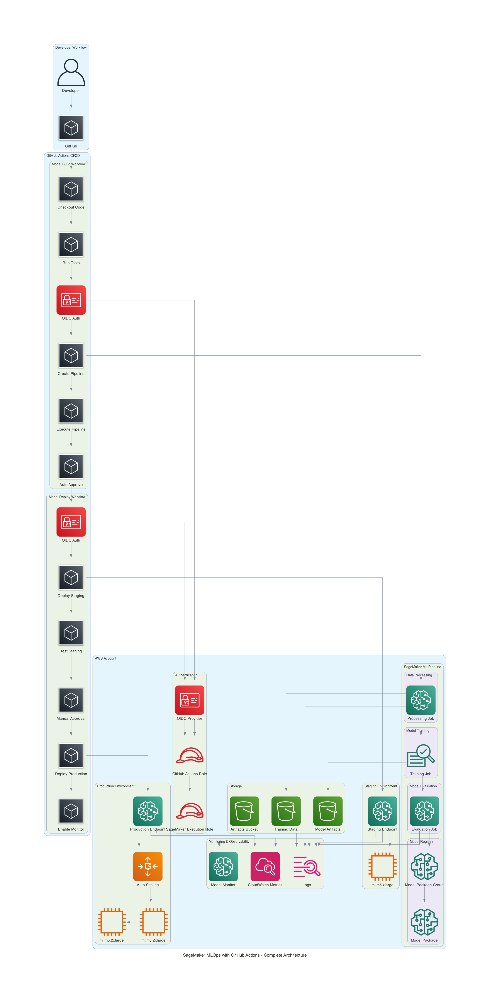

# SageMaker MLOps with GitHub Actions

Complete MLOps solution using Amazon SageMaker and GitHub Actions for CI/CD, replacing AWS CodePipeline and CodeBuild with GitHub's native automation.

## Architecture

### Complete System Architecture



**See [ARCHITECTURE_DIAGRAMS.md](ARCHITECTURE_DIAGRAMS.md) for all diagrams and detailed explanations.**

### Key Components

```
┌─────────────────────────────────────────────────────────────────┐
│                     GITHUB ACTIONS CI/CD                         │
└─────────────────────────────────────────────────────────────────┘
                              │
        ┌─────────────────────┴─────────────────────┐
        │                                           │
        ▼                                           ▼
┌──────────────────┐                    ┌──────────────────────┐
│  Model Build     │                    │  Model Deploy        │
│  Workflow        │                    │  Workflow            │
├──────────────────┤                    ├──────────────────────┤
│ 1. Run Tests     │                    │ 1. Get Approved      │
│ 2. Create        │                    │    Model             │
│    Pipeline      │                    │ 2. Deploy Staging    │
│ 3. Train Model   │                    │ 3. Test Staging      │
│ 4. Evaluate      │                    │ 4. Manual Approval   │
│ 5. Register      │                    │ 5. Deploy Production │
│ 6. Auto-Approve  │                    │ 6. Enable Monitoring │
└──────────────────┘                    └──────────────────────┘
        │                                           │
        └─────────────────────┬─────────────────────┘
                              ▼
                    ┌──────────────────┐
                    │  SageMaker       │
                    │  Infrastructure  │
                    ├──────────────────┤
                    │ • Pipelines      │
                    │ • Model Registry │
                    │ • Endpoints      │
                    │ • Monitoring     │
                    └──────────────────┘
```

### Additional Diagrams

- **Model Build Pipeline:** [model-build-pipeline-detailed.png](generated-diagrams/model-build-pipeline-detailed.png)
- **Deployment Pipeline (Lab 5):** [deployment-pipeline-lab5.png](generated-diagrams/deployment-pipeline-lab5.png)
- **GitHub vs AWS Comparison:** [github-vs-aws-comparison.png](generated-diagrams/github-vs-aws-comparison.png)
- **OIDC Authentication:** [oidc-authentication-flow.png](generated-diagrams/oidc-authentication-flow.png)
- **Data Flow:** [data-flow-training-to-production.png](generated-diagrams/data-flow-training-to-production.png)

## Features

- ✅ **GitHub Actions CI/CD** - No CodePipeline or CodeBuild needed
- ✅ **SageMaker Pipelines** - Automated ML workflows
- ✅ **Model Registry** - Version control for models
- ✅ **Automated Testing** - Unit tests and endpoint tests
- ✅ **Multi-Environment** - Staging and production deployments
- ✅ **Manual Approval Gates** - Control production deployments
- ✅ **Auto-scaling** - Production endpoints scale automatically
- ✅ **Model Monitoring** - Data capture and drift detection
- ✅ **OIDC Authentication** - Secure, keyless AWS access

## Prerequisites

- AWS Account with SageMaker access
- GitHub repository
- Terraform >= 1.0
- Python 3.10+
- AWS CLI configured

## Quick Start

### 1. Clone and Setup

```bash
git clone <your-repo>
cd sagemaker-mlops-github
```

### 2. Deploy Infrastructure with Terraform

```bash
cd terraform

# Copy and edit variables
cp terraform.tfvars.example terraform.tfvars
# Edit terraform.tfvars with your GitHub org/repo

# Initialize and deploy
terraform init
terraform plan
terraform apply
```

This creates:
- S3 bucket for artifacts
- IAM roles (SageMaker execution, GitHub Actions)
- Model Package Group
- GitHub OIDC provider

### 3. Configure GitHub Secrets

Add these secrets to your GitHub repository (Settings → Secrets and variables → Actions):

```
AWS_ROLE_ARN: <github_actions_role_arn from terraform output>
SAGEMAKER_EXECUTION_ROLE_ARN: <sagemaker_execution_role_arn from terraform output>
```

Optional (for Slack notifications):
```
SLACK_WEBHOOK_URL: <your-slack-webhook>
```

### 4. Configure GitHub Environments

Create two environments in your repository (Settings → Environments):

**staging:**
- No protection rules needed
- Deployment URL: AWS Console link (auto-populated)

**production:**
- Enable "Required reviewers" (add yourself or team)
- This creates the manual approval gate

### 5. Push Code to Trigger Pipeline

```bash
git add .
git commit -m "Initial MLOps setup"
git push origin main
```

This triggers the Model Build workflow automatically!

## Workflows

### Model Build Pipeline (`.github/workflows/model-build.yml`)

**Triggers:**
- Push to `main` or `develop` branches
- Changes to `pipelines/`, `preprocessing/`, `training/`, `evaluation/` folders
- Manual trigger via GitHub UI

**Steps:**
1. Checkout code
2. Setup Python and install dependencies
3. Run tests with pytest
4. Configure AWS credentials (OIDC)
5. Create/update SageMaker Pipeline
6. Start pipeline execution
7. Wait for completion (with timeout)
8. Get results and metrics
9. Auto-approve model if accuracy >= 0.8

**Outputs:**
- Pipeline execution ARN
- Model package ARN (if registered)
- Model metrics (accuracy, etc.)

### Model Deploy Pipeline (`.github/workflows/model-deploy.yml`)

**Triggers:**
- Successful completion of Model Build workflow
- Manual trigger with model package ARN

**Staging Deployment:**
1. Get latest approved model
2. Deploy to staging endpoint (ml.m5.xlarge, 1 instance)
3. Wait for endpoint to be InService
4. Run automated tests
5. Upload test results

**Production Deployment:**
1. Download staging test results
2. Validate tests (accuracy >= 0.85)
3. **Manual approval required** (GitHub environment protection)
4. Deploy to production (ml.m5.2xlarge, 2-10 instances with autoscaling)
5. Wait for endpoint
6. Run smoke tests
7. Enable Model Monitor
8. Send Slack notification

## Project Structure

```
sagemaker-mlops-github/
├── .github/
│   └── workflows/
│       ├── model-build.yml       # Build and train pipeline
│       └── model-deploy.yml      # Deployment pipeline
├── pipelines/
│   ├── create_pipeline.py        # Create SageMaker Pipeline
│   ├── run_pipeline.py           # Start execution
│   ├── wait_pipeline.py          # Wait for completion
│   └── get_results.py            # Extract results
├── preprocessing/
│   └── preprocess.py             # Data preprocessing script
├── training/
│   └── train.py                  # Model training script
├── evaluation/
│   └── evaluate.py               # Model evaluation script
├── deployment/
│   ├── deploy_endpoint.py        # Deploy endpoint
│   └── wait_endpoint.py          # Wait for endpoint
├── scripts/
│   ├── get_latest_model.py       # Get model from registry
│   ├── approve_model.py          # Approve model
│   └── validate_tests.py         # Validate test results
├── tests/
│   ├── test_endpoint.py          # Endpoint testing
│   └── test_data.json            # Test data samples
├── monitoring/
│   └── setup_monitor.py          # Setup Model Monitor
├── terraform/
│   ├── main.tf                   # Infrastructure
│   ├── variables.tf              # Variables
│   ├── outputs.tf                # Outputs
│   └── terraform.tfvars.example  # Example config
├── requirements.txt              # Python dependencies
└── README.md                     # This file
```

## Customization

### Change Model Algorithm

Edit `pipelines/create_pipeline.py`:

```python
# Replace XGBoost with your algorithm
estimator = Estimator(
    image_uri="your-algorithm-image",
    instance_type=training_instance_type,
    # ... your hyperparameters
)
```

### Adjust Approval Thresholds

**Auto-approval threshold** (`.github/workflows/model-build.yml`):
```yaml
- name: Approve Model for Deployment
  run: |
    python scripts/approve_model.py \
      --min-accuracy 0.8  # Change this
```

**Production validation** (`.github/workflows/model-deploy.yml`):
```yaml
- name: Validate Staging Tests
  run: |
    python scripts/validate_tests.py \
      --min-accuracy 0.85  # Change this
```

### Modify Instance Types

**Staging:**
```yaml
--instance-type ml.m5.xlarge
--instance-count 1
```

**Production:**
```yaml
--instance-type ml.m5.2xlarge
--instance-count 2
--enable-autoscaling
--min-capacity 2
--max-capacity 10
```

### Add More Environments

1. Create new environment in GitHub
2. Duplicate deployment job in `model-deploy.yml`
3. Update endpoint names and configurations

## Monitoring

### View Pipeline Executions

```bash
# AWS Console
https://console.aws.amazon.com/sagemaker/home?region=us-east-1#/pipelines

# Or via CLI
aws sagemaker list-pipeline-executions \
  --pipeline-name mlops-demo-pipeline
```

### View Endpoints

```bash
# AWS Console
https://console.aws.amazon.com/sagemaker/home?region=us-east-1#/endpoints

# Or via CLI
aws sagemaker describe-endpoint \
  --endpoint-name mlops-demo-production
```

### View Model Registry

```bash
aws sagemaker list-model-packages \
  --model-package-group-name mlops-demo-model-group
```

### GitHub Actions Logs

All workflow runs are visible in your repository:
- Go to "Actions" tab
- Click on workflow run
- View detailed logs for each step

## Troubleshooting

### Pipeline Fails to Start

**Issue:** `AccessDeniedException` when creating pipeline

**Solution:** Verify IAM roles have correct permissions:
```bash
terraform output github_actions_role_arn
# Check this role has sagemaker:CreatePipeline permission
```

### Endpoint Deployment Fails

**Issue:** Endpoint stuck in "Creating" or fails

**Solution:** Check CloudWatch logs:
```bash
aws logs tail /aws/sagemaker/Endpoints/mlops-demo-staging --follow
```

### GitHub Actions Can't Assume Role

**Issue:** `Error: Not authorized to perform sts:AssumeRoleWithWebIdentity`

**Solution:** 
1. Verify OIDC provider exists
2. Check trust policy in GitHub Actions role
3. Ensure repository name matches in trust policy

### Model Not Auto-Approved

**Issue:** Model registered but not approved

**Solution:** Check accuracy threshold in results:
```bash
# View results.json artifact in GitHub Actions
# Ensure accuracy >= 0.8
```

## Cost Optimization

- **Use Spot Instances** for training (add to estimator config)
- **Enable Autoscaling** for production endpoints
- **Use Serverless Inference** for low-traffic endpoints
- **Delete unused endpoints** after testing
- **Use SageMaker Savings Plans** for consistent usage

## Security Best Practices

✅ **OIDC Authentication** - No long-lived AWS credentials
✅ **Least Privilege IAM** - Minimal permissions for each role
✅ **Encryption** - S3 bucket encrypted at rest
✅ **VPC Endpoints** - Keep traffic within AWS network (optional)
✅ **Model Approval** - Manual gate before production
✅ **Environment Protection** - GitHub environment rules

## Next Steps

1. **Add Data Preprocessing** - Implement `preprocessing/preprocess.py`
2. **Add Training Code** - Implement `training/train.py`
3. **Add Evaluation Logic** - Implement `evaluation/evaluate.py`
4. **Setup Model Monitor** - Implement `monitoring/setup_monitor.py`
5. **Add More Tests** - Expand `tests/` directory
6. **Configure Alerts** - Setup CloudWatch alarms
7. **Add A/B Testing** - Deploy multiple model variants

## Resources

- [SageMaker Pipelines Documentation](https://docs.aws.amazon.com/sagemaker/latest/dg/pipelines.html)
- [GitHub Actions for AWS](https://github.com/aws-actions)
- [SageMaker Model Registry](https://docs.aws.amazon.com/sagemaker/latest/dg/model-registry.html)
- [SageMaker Model Monitor](https://docs.aws.amazon.com/sagemaker/latest/dg/model-monitor.html)

## License

MIT License - feel free to use and modify for your projects!
