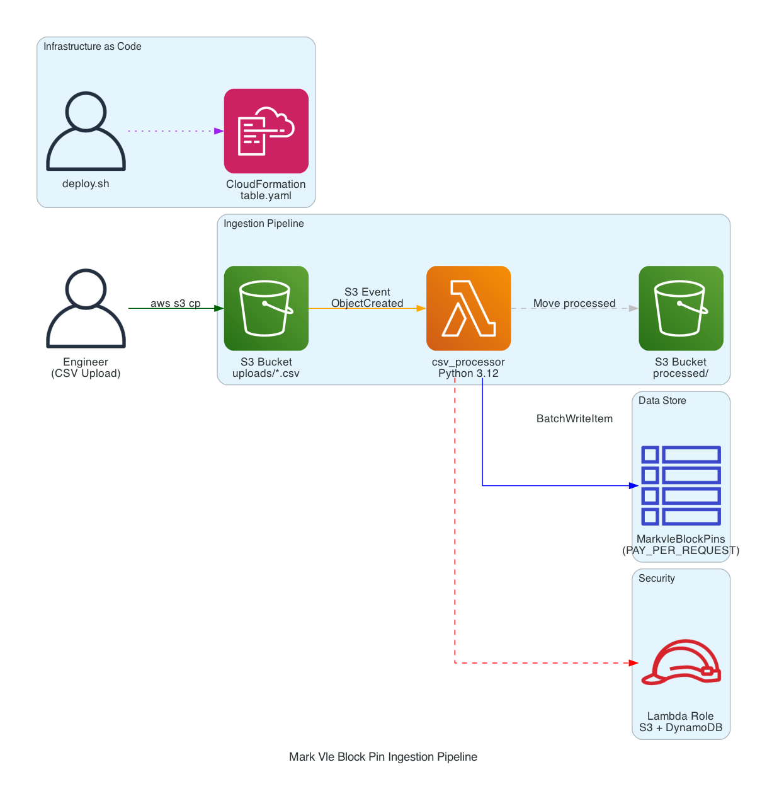

# DynamoDB Block Pin Ingestion Pipeline

Event-driven ingestion pipeline for Mark VIe control system pin report CSVs. Uploads to S3 trigger an automated workflow that parses pin data and stores it in DynamoDB using a pin-level single-table design.

## Architecture



**Flow:** S3 (CSV upload to `knowledgebase/`) → EventBridge (Object Created rule) → Step Functions workflow → Lambda (parse CSV, batch write pins) → DynamoDB

**Step Functions Workflow:**
1. **RecordUploadReceived** — PutItem to tracker table with status `RECEIVED`
2. **ProcessPinReport** — Invoke Lambda to parse CSV and write pins to DynamoDB
3. **RecordCompleted / RecordFailed** — UpdateItem on tracker with final status, context, and counts

## S3 Bucket Structure

| Folder | Purpose | Auto-processing |
|--------|---------|-----------------|
| `knowledgebase/` | Pin report CSV uploads | Yes — triggers ingestion workflow |
| `active-project/` | Active project files for storage | No |

## Upload Tracking

Every upload is tracked in the upload tracker table (`markvie-kb-upload-tracker-poc`) with:
- Upload ID (Step Functions execution name)
- Status progression: `RECEIVED` → `COMPLETED` or `FAILED`
- Project context (unique systems found in CSV)
- Task context (unique tasks found in CSV)
- Row/item counts, file size, timestamps
- GSI on `UploadStatus` + `UploadTimestamp` for querying by status

## Deploy

```bash
export AWS_PROFILE=zuberua-Admin
export AWS_REGION=us-west-2

./deploy.sh
```

This will:
1. Deploy/update the CloudFormation stack (S3, EventBridge, Step Functions, Lambda, DynamoDB tables, IAM roles)
2. Package and deploy the Lambda function code

## Upload Data

```bash
aws s3 cp data/sample_pins.csv \
  s3://markvie-kb-138720056246/knowledgebase/sample_pins.csv \
  --profile zuberua-Admin --region us-west-2
```

The file will be automatically processed and deleted from `knowledgebase/` after ingestion.

## Monitor Executions

```bash
# List recent executions
aws stepfunctions list-executions \
  --state-machine-arn arn:aws:states:us-west-2:138720056246:stateMachine:markvie-kb-pin-ingestion-poc \
  --max-results 5 --profile zuberua-Admin --region us-west-2

# Check upload tracker
aws dynamodb scan --table-name markvie-kb-upload-tracker-poc \
  --profile zuberua-Admin --region us-west-2
```

## Query Examples

Get all pins for a specific block:

```bash
aws dynamodb query \
  --table-name markvie-kb-poc \
  --key-condition-expression "PK = :pk AND begins_with(SK, :sk)" \
  --expression-attribute-values '{
    ":pk":{"S":"SYS#GREENLAND POWER|DEV#T1|PG#Logic|PROG#Logic|TASK#TempMonitor"},
    ":sk":{"S":"BEX#0002|BLK#MOVE_1"}
  }' \
  --profile zuberua-Admin --region us-west-2
```

Get all pins in a task (full execution order):

```bash
aws dynamodb query \
  --table-name markvie-kb-poc \
  --key-condition-expression "PK = :pk" \
  --expression-attribute-values '{
    ":pk":{"S":"SYS#GREENLAND POWER|DEV#T1|PG#Logic|PROG#Logic|TASK#TempMonitor"}
  }' \
  --profile zuberua-Admin --region us-west-2
```

Trace a connection (ConnectionIndex GSI):

```bash
aws dynamodb query \
  --table-name markvie-kb-poc \
  --index-name ConnectionIndex \
  --key-condition-expression "GSI3PK = :conn" \
  --expression-attribute-values '{
    ":conn":{"S":"CONN#v_8a2x9"}
  }' \
  --profile zuberua-Admin --region us-west-2
```

Count total items:

```bash
aws dynamodb scan \
  --table-name markvie-kb-poc \
  --select COUNT \
  --profile zuberua-Admin --region us-west-2
```

## Resource Names

| Resource | Name |
|----------|------|
| CloudFormation Stack | `markvie-kb-resources-poc` |
| S3 Bucket | `markvie-kb-138720056246` |
| DynamoDB (pins) | `markvie-kb-poc` |
| DynamoDB (tracker) | `markvie-kb-upload-tracker-poc` |
| Lambda | `markvie-kb-processor-poc` |
| Step Functions | `markvie-kb-pin-ingestion-poc` |
| EventBridge Rule | `markvie-kb-rule-poc` |
| IAM (Lambda) | `markvie-kb-processor-role-poc` |
| IAM (Step Functions) | `markvie-kb-sfn-role-poc` |
| IAM (EventBridge) | `markvie-kb-eventbridge-role-poc` |

## Project Structure

```
dynamodb-block-schema/
├── cloudformation/
│   └── table.yaml          # Full stack: S3, EventBridge, Step Functions, Lambda, DynamoDB, IAM
├── lambda/
│   └── csv_processor/
│       └── handler.py      # CSV parser and DynamoDB batch writer
├── data/
│   └── sample_pins.csv     # Sample pin report for testing
├── scripts/
│   └── trace_connection.py # Connection trace utility
├── docs/
│   ├── architecture.png    # AWS architecture diagram
│   └── generate_architecture_diagram.py
├── deploy.sh               # Build and deploy script
└── README.md
```

## Schema Reference

See [SCHEMA_COMPARISON.md](../docs/SCHEMA_COMPARISON.md) for full schema comparison and recommendation.


## Acceptance Criteria

### US-01 Pin Report Upload 

1. Accepts Pin Report uploads through the defined ingestion path — CSV files uploaded to s3://markvie-kb-138720056246/knowledgebase/ automatically trigger the EventBridge → Step Functions → Lambda pipeline. Tested end-to-end.


2. Each upload is associated with project and task context — The Lambda extracts unique systems (project context) and unique tasks (task context) from the CSV data and returns them. The Step Functions RecordCompleted state writes both to the tracker table as ProjectContext and TaskContext fields.

3. Upload status and processing outcome are captured for review — The tracker table records status progression (RECEIVED → COMPLETED or FAILED), timestamps, rows parsed, items written, file size, error messages on failure, and the project/task context. The StatusIndex GSI lets you query by status and time range.


### US-02 Event-Driven Ingestion

1. S3 Object Created event triggers EventBridge — The S3 bucket has EventBridgeEnabled: true, and the EventBridge rule matches Object Created events with prefix: knowledgebase/ on that bucket.

2. EventBridge starts the Step Functions workflow — The rule's target is the Step Functions state machine ARN, with an IAM role that has states:StartExecution permission.

3. The workflow invokes one processing Lambda for parsing and normalization — The ProcessPinReport state invokes the single csv_processor Lambda, which downloads the CSV from S3, parses it, normalizes the data into the pin-level schema, and batch-writes to DynamoDB. One Lambda, one invocation per upload.