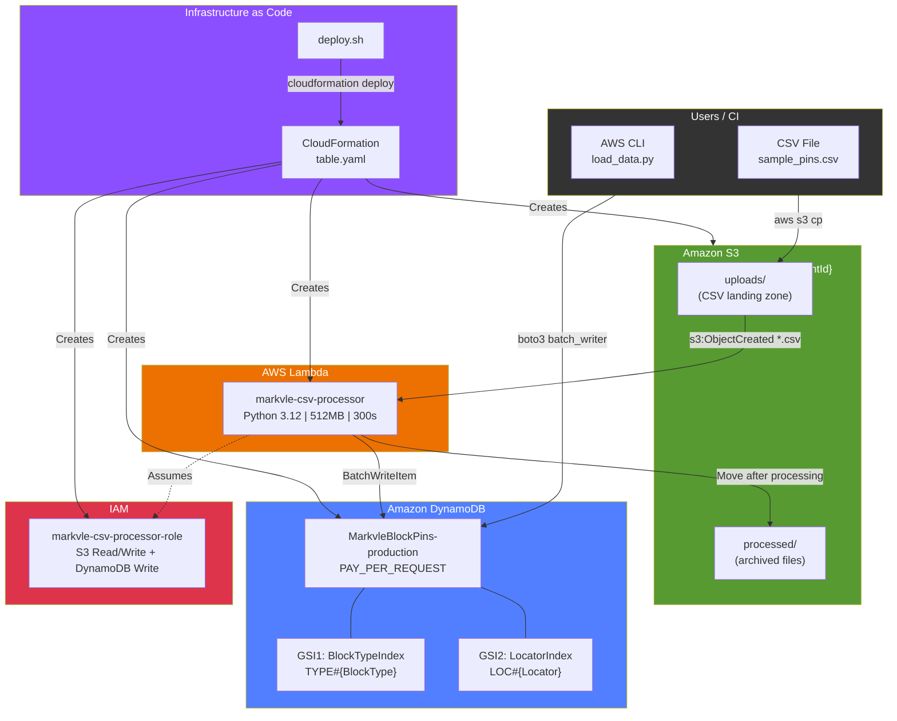
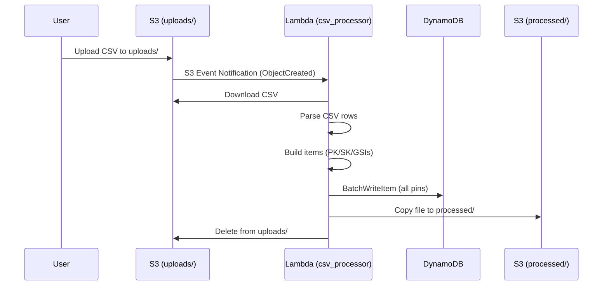
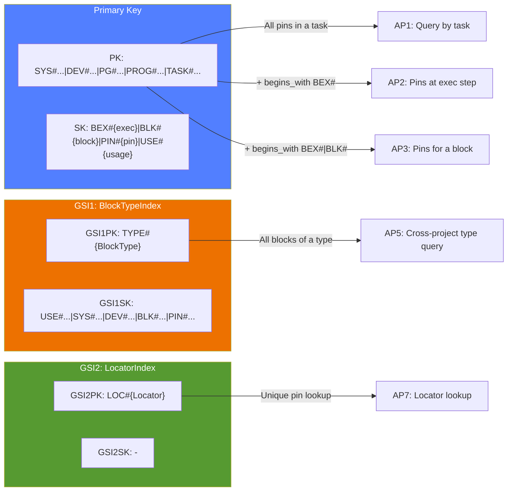

# Architecture — Mark Vle Block Pin Ingestion Pipeline

## Infrastructure Diagram

```mermaid
graph TB
    subgraph Users["Users / CI"]
        CLI["AWS CLI<br/>load_data.py"]
        CSV["CSV File<br/>sample_pins.csv"]
    end

    subgraph S3["Amazon S3<br/>markvle-block-pins-{AccountId}"]
        UPLOADS["uploads/<br/>(CSV landing zone)"]
        PROCESSED["processed/<br/>(archived files)"]
    end

    subgraph Compute["AWS Lambda"]
        LAMBDA["markvle-csv-processor<br/>Python 3.12 | 512MB | 300s"]
    end

    subgraph Database["Amazon DynamoDB"]
        TABLE["MarkvleBlockPins-production<br/>PAY_PER_REQUEST"]
        GSI1["GSI1: BlockTypeIndex<br/>TYPE#{BlockType}"]
        GSI2["GSI2: LocatorIndex<br/>LOC#{Locator}"]
    end

    subgraph IAM["IAM"]
        ROLE["markvle-csv-processor-role<br/>S3 Read/Write + DynamoDB Write"]
    end

    subgraph IaC["Infrastructure as Code"]
        CFN["CloudFormation<br/>table.yaml"]
        DEPLOY["deploy.sh"]
    end

    CSV -->|"aws s3 cp"| UPLOADS
    CLI -->|"boto3 batch_writer"| TABLE
    UPLOADS -->|"s3:ObjectCreated *.csv"| LAMBDA
    LAMBDA -->|"BatchWriteItem"| TABLE
    LAMBDA -->|"Move after processing"| PROCESSED
    LAMBDA -.->|"Assumes"| ROLE
    TABLE --- GSI1
    TABLE --- GSI2
    DEPLOY -->|"cloudformation deploy"| CFN
    CFN -->|"Creates"| S3
    CFN -->|"Creates"| LAMBDA
    CFN -->|"Creates"| TABLE
    CFN -->|"Creates"| ROLE

    style S3 fill:#569A31,color:#fff
    style Compute fill:#ED7100,color:#fff
    style Database fill:#527FFF,color:#fff
    style IAM fill:#DD344C,color:#fff
    style IaC fill:#8C4FFF,color:#fff
    style Users fill:#333,color:#fff
```

## Data Flow

```mermaid
sequenceDiagram
    participant User
    participant S3 as S3 (uploads/)
    participant Lambda as Lambda (csv_processor)
    participant DDB as DynamoDB
    participant S3P as S3 (processed/)

    User->>S3: Upload CSV to uploads/
    S3->>Lambda: S3 Event Notification (ObjectCreated)
    Lambda->>S3: Download CSV
    Lambda->>Lambda: Parse CSV rows
    Lambda->>Lambda: Build items (PK/SK/GSIs)
    Lambda->>DDB: BatchWriteItem (all pins)
    Lambda->>S3P: Copy file to processed/
    Lambda->>S3: Delete from uploads/
```

## DynamoDB Key Design

```mermaid
graph LR
    subgraph PrimaryKey["Primary Key"]
        PK["PK: SYS#...|DEV#...|PG#...|PROG#...|TASK#..."]
        SK["SK: BEX#{exec}|BLK#{block}|PIN#{pin}|USE#{usage}"]
    end

    subgraph GSI1["GSI1: BlockTypeIndex"]
        G1PK["GSI1PK: TYPE#{BlockType}"]
        G1SK["GSI1SK: USE#...|SYS#...|DEV#...|BLK#...|PIN#..."]
    end

    subgraph GSI2["GSI2: LocatorIndex"]
        G2PK["GSI2PK: LOC#{Locator}"]
        G2SK["GSI2SK: -"]
    end

    PK -->|"All pins in a task"| AP1["AP1: Query by task"]
    PK -->|"+ begins_with BEX#"| AP2["AP2: Pins at exec step"]
    PK -->|"+ begins_with BEX#|BLK#"| AP3["AP3: Pins for a block"]
    G1PK -->|"All blocks of a type"| AP5["AP5: Cross-project type query"]
    G2PK -->|"Unique pin lookup"| AP7["AP7: Locator lookup"]

    style PrimaryKey fill:#527FFF,color:#fff
    style GSI1 fill:#ED7100,color:#fff
    style GSI2 fill:#569A31,color:#fff
```
